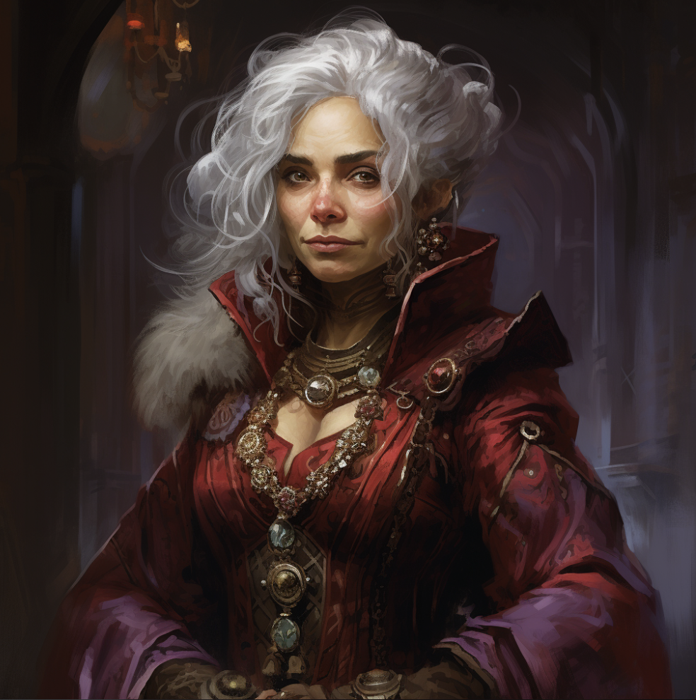

# Glitter

| | |
| --- | --- |
| **Real Name** | Binderly Bimpnottin |
| **Title** | Shipping & Receiving Supervisor |
| **Affiliation** | College of Drystone, Logistics & Administration |
| **Base** | Korranberg, Zilargo |

> "I don't remember your name. I remember everything else about you."

## Overview

Glitter runs the Shipping & Receiving warehouse beneath the College of Drystone with the quiet authority of someone who has already decided what will happen before anyone else has finished asking. She is missing her left arm below the shoulder, which she makes no effort to conceal or explain. She prefers fine silks in deep colors — burgundy, forest green, black — though she keeps several sets of combat armor maintained and accessible for what she calls her hunting needs. Her silver hair is enormous: matted, messy, and big in a way that suggests it has its own agenda. She has several tiny ruby earrings on each ear, enough that they catch the light when she turns her head.

She cares significantly about what others think of her — not in a fragile way, but in the way of someone for whom reputation is a professional tool. When someone's opinion aligns with hers, she is generous and warm. When opinions clash, she becomes argumentative with a speed and intensity that surprises people who only know her from the silks.

She is, with genuine embarrassment, terrible with names. She will try to learn them, fail two or three times, and then quietly assign descriptors to people until the name finally sticks. She finds this mortifying. She powers through anyway.

## Abilities

Glitter is methodical, patient, and significantly harder to rattle than she looks. Her background in bounty hunting gave her a practical intelligence about people — how they move, what they're hiding, when they're about to run. She has applied this to logistics with results that are, in her words, a lateral move. The warehouse is more organized than it appears, and appears significantly more organized than it was when she arrived.

## Activities

Glitter oversees all physical intake and outflow for the college. Every object that enters or leaves the building passes through her department. She manages a staff she trusts to varying degrees and a relationship with Administration she manages carefully. She reports to Umpeen Bafflestone on certain matters she does not discuss with her regular staff.

---

## Secrets

> *DM Eyes Only*

### The Trust

Glitter is a Level 2 operative in the Trust. Shipping & Receiving is an ideal intelligence posting: she controls what moves through the building and maintains the ability to hold, inspect, or redirect any physical asset entering the college. She handles special acquisitions, materials of interest, and objects that need to arrive without appearing in official inventory. Umpeen is her direct superior in the Trust hierarchy.

### The Arm

The left arm was lost on a contract she does not discuss. The nature of the contract — who hired her, what went wrong, whether the target survived — is not in any file. She transitioned out of active bounty hunting shortly after. Whether this was the Trust's suggestion or her own decision is unclear. Possibly both.

### The Name

The name Glitter was given to her by a target who thought he was being cruel. She kept it. He did not keep his freedom. She considers this an equitable outcome.
