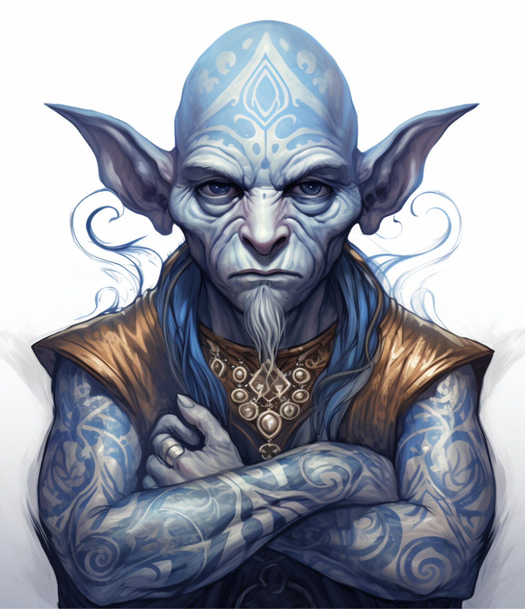

# Jabbie Boondiggles

| | |
| --- | --- |
| **Title** | Executive Assistant, Shipping & Receiving |
| **Affiliation** | College of Drystone, Logistics & Administration |
| **Base** | Korranberg, Zilargo |

> "You haven't eaten. Sit down."

## Overview

Jabbie presents as a gnome of late middle age, compact and slightly soft around the middle in the way of someone who tastes everything professionally and regrets nothing. His skin is an unusual pale yellow — not sickly, just slightly off in a way that reads as a quirk of complexion rather than a cause for concern. His arms and neck are covered in dense blue tattoos, intricate and geometric, that occasionally seem to shift when caught in certain light. He keeps his dark hair short and neat. His clothes are always clean and practical, with at least one apron pocket containing something edible.

He appears, at first glance, to be a simpleton. He speaks slowly, asks simple questions about food, and seems primarily interested in whether you have eaten recently. This impression does not survive extended contact. He is one of the most perceptive individuals in the building and uses hospitality as his primary mode of assessment. What someone eats, how they eat it, what they decline, and what they pretend not to want tells him more than most conversations. He is warm without being effusive, curious without being intrusive, and patient in a way that suggests he has a very different relationship with time than most people do.

## Abilities

Jabbie is a world-renowned chef who has studied cuisine across Khorvaire with teachers he is characteristically vague about. His culinary skill is genuine and exceptional. He is also, beneath the slow speech and the snacks, an observer of uncommon precision. He forgets nothing. He corrects nothing in the moment.

## Activities

Jabbie sits at a desk in a cubicle outside the warehouse elevator. Adjacent to his desk is a small kitchenette — a hot plate apparatus, a tiny sink, and whatever he is currently working on. The elevator behind him goes to Glitter's office. He manages Glitter's schedule, her correspondence, and her tolerance for being interrupted. He also feeds people. This is not incidental to his function.

---

## Secrets

> *DM Eyes Only*

### The Dragon

Jabbie is a Vortex Dragon. His gnomish form is a permanent disguise maintained with complete ease. The blue tattoos are the only visible trace of his true nature — they are his scale patterning bleeding through the illusion in certain light conditions. He is aware of this and unconcerned. His patience, his stillness, and his indifference to urgency are not personality quirks. They are the disposition of something very old operating on a much longer timeline than the people around him.

### The Knowledge

Jabbie's true name, his wyer allegiance, and his reasons for being stationed in this specific building are known only to the Doyenne and senior members of House Sivis. He does not discuss any of this. He offers food instead. What he is specifically watching for, reporting on, or waiting for has not been communicated to anyone currently in the building.

### The Restaurant

He owned and operated a small restaurant in Korranberg for several years. By all accounts exceptional. It closed abruptly and without explanation. He appeared in Shipping & Receiving shortly after. There is no documentation of how this transition occurred or who arranged it.
