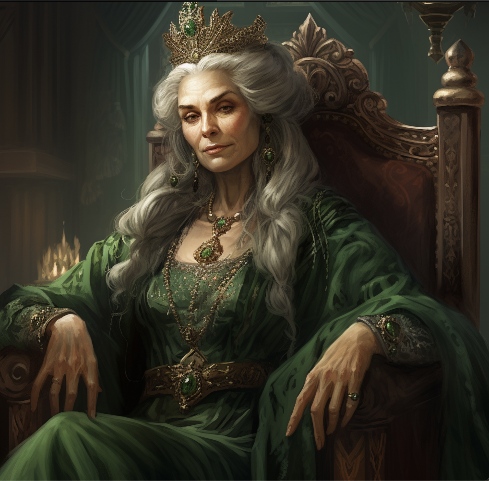
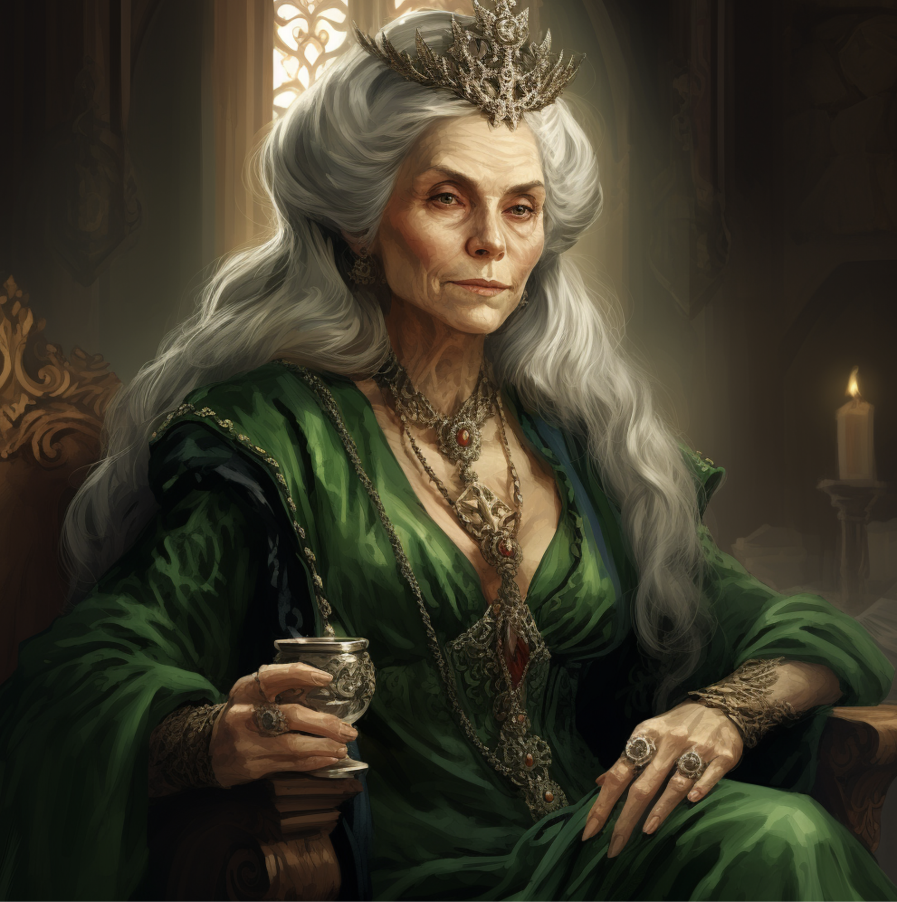

# Lysse Lyrriman d'Sivis

| | |
| --- | --- |
| **Title** | The Doyenne |
| **House** | House Sivis, Lyrriman clan |
| **Base** | Korranberg, Zilargo |
| **Tenure** | ~90 years as ruling matriarch |

> "Communication is the lifeblood of civilization."

## Overview

Lysse Lyrriman d'Sivis is the matriarch of House Sivis and the most powerful gnome in Zilargo. Under the title of Doyenne, she has ruled the governing High Council of House Sivis for nearly ninety years — an extraordinarily long tenure even by gnomish standards. She is publicly renowned for her administrative precision, her skill as a negotiator, and her gift for seeing political situations ten moves ahead.

In person, Lysse projects warmth and intellectual curiosity — the archetypal brilliant gnome grandmother. Her political rivals have long since learned not to mistake her approachability for softness.

## Abilities

Lysse is renowned as an incredibly clever planner and negotiator, a skilled administrator, and a cunning strategist. She rarely moves without having already considered the three most likely responses to her action and the contingencies for each.

## Activities

Beyond administering House Sivis, Lysse has invested significantly in **Tasker's Dream** — a project initiated by Tasker Torralyn d'Sivis to decode draconic prophecy. The project is officially framed as an academic endeavor in collaboration with the Library of Korranberg and the Tabernacle college. Its actual scope is considerably broader.

She is currently listed as being on sabbatical from an academic post at a prestigious institution. She remains fully active in her House Sivis duties — the sabbatical refers to other responsibilities she has stepped away from temporarily.

---

## Secrets

> *DM Eyes Only*

### The Protector

Lysse Lyrriman d'Sivis is not merely the head of House Sivis. She is the **Protector** — the supreme head of the Trust. The Trust's leadership structure ensures the Protector is always the leader of House Sivis. All actual House Sivis nobles are current or former Trust members and are aware of this fact. Very few outsiders are.

### The Dragon Beneath

The Doyenne is not a gnome. She is **Alyssa Siviridion**, an emerald dragon and the head of the **Emerald Dragon Wyer** of Argonessen. Like all dragonmarked house nobility, she maintains a permanent gnomish disguise as her primary identity. Her true form has not been seen in Korranberg in living memory.

All dragonmarked house nobility across Khorvaire are similarly dragons in disguise, operating under the direction of Argonessen's dragon factions to guide and control the development of mortal civilization — and to advance their interpretation of the Draconic Prophecy.

### The Sabbatical

Alyssa Siviridion holds a professorship of Prophecy Studies at a prestigious draconic institution colloquially known as "the Diddly." She is currently on sabbatical from that post, suggesting that events in Khorvaire — possibly related to the Prophecy or to Tasker's Dream — have required her personal attention.

What specifically prompted the sabbatical is unknown. It may relate to an emerging convergence in the Draconic Prophecy, a threat to the wyer's influence over House Sivis, or something the Trust has uncovered that required the Protector's direct involvement.
