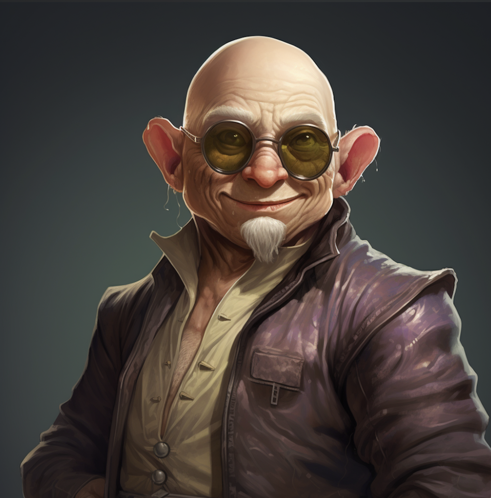

# Umpeen Bafflestone

| | |
| --- | --- |
| **Title** | Administrative Greeter |
| **Affiliation** | College of Drystone, Administration |
| **Base** | Korranberg, Zilargo |

> "State your business. Then your name. In that order."

## Overview

Umpeen runs the reception desk in the Administration basement of the College of Drystone with the energy of someone who takes the job extremely seriously and wants everyone to know it. He wears very tight pants and sleeveless undershirts, occasionally topped with a dark overcoat with no apparent awareness of how this combination reads. He has a moderate pudge and is not particularly fit. His head is shaved completely bald and polished. He wears large industrial goggles pushed up on his forehead at all times — never down — which raises the question of what they are for. His hands are rough and calloused in the specific way of someone who spent years doing physical labor before transitioning to desk work.

He is eccentric and domineering, driving every conversation whether or not he was invited into it. He is skeptical of what others tell him and slow to extend trust, preferring to verify independently before accepting any claim at face value. He is not unkind. He is thorough. These are not always the same thing.

## Abilities

His father was a mechanic who could fix anything with whatever was available, and Umpeen learned the same approach: assess what you have, figure out what it can do, make it work. He applies this methodology to people as readily as to objects. He also has an exceptional memory for faces, names, and stated purposes — a useful trait in a greeter, not accidental in an operative.

## Activities

Every person who enters the Administration basement passes through Umpeen's desk. He controls access to all three unmarked doors and manages the flow of visitors to every department on the lower floor. He is rarely fooled by stated reasons for visits. He files everything.

---

## Secrets

> *DM Eyes Only*

### The Operative

Umpeen is a Level 3 operative in the Trust — the supervisor of all Trust assets stationed on the lower floors of the college, including Glitter in Shipping & Receiving. His position as Greeter is the ideal intelligence post: he observes and logs every individual who enters the basement, notes anomalies in behavior and stated purpose, and routes persons of interest toward or away from certain doors as needed. He has done this for eleven years without incident.

### The Chain

He reports to a Level 4 Sub-Director based on the 10th floor (Innovation & Transformation) whose name does not appear in any college directory. When IT is involved, Umpeen nods once and changes the subject. This is not deference. It is protocol.

### Before Drystone

His employment history prior to the College of Drystone is not in any file the college has access to. He left his father's shop when an opportunity presented itself and has never been specific about what that opportunity was or who extended it. The eleven years at Drystone are documented. Everything before is not.
